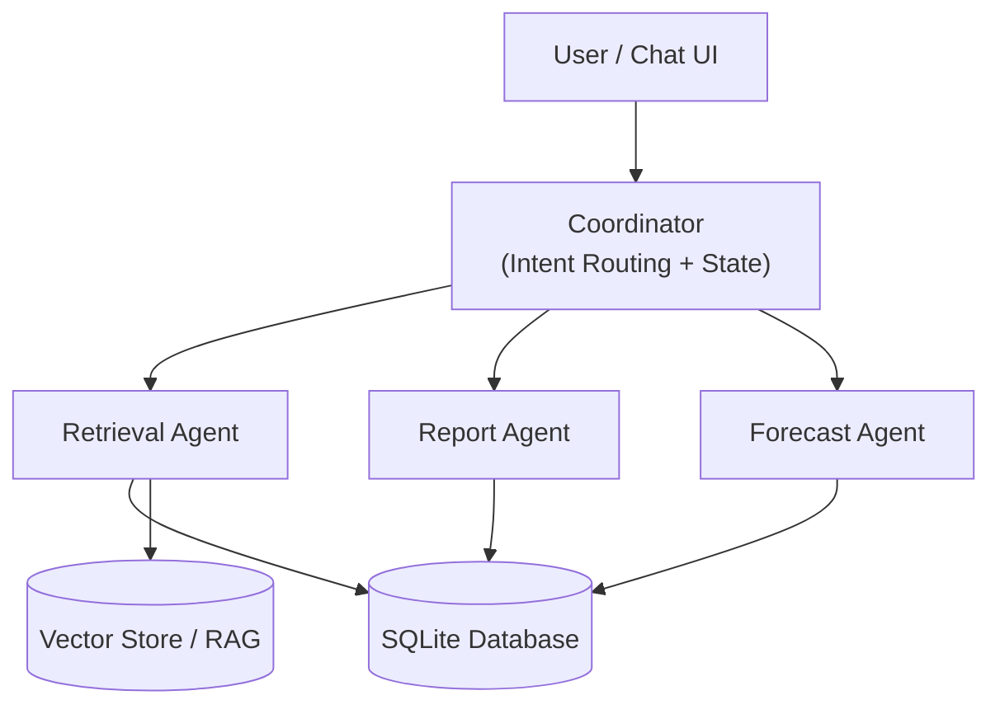
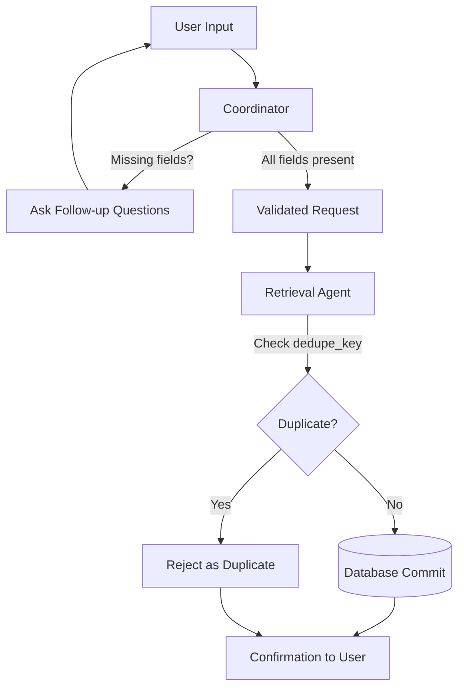
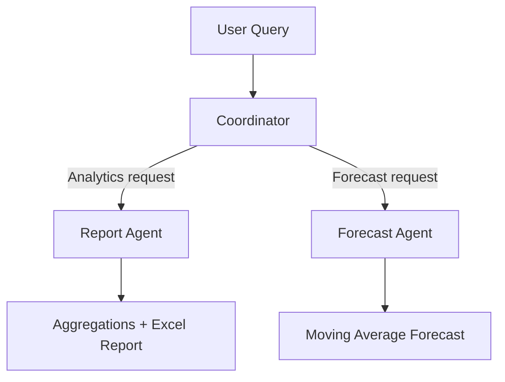

# Returns & Warranty Intelligence

# Overview

This project implements an end-to-end AI-assisted system to ingest, analyze, retrieve, and forecast product return data through a chat-based interface.

The system combines:
- Transactional data ingestion with deduplication

- Semantic retrieval (RAG) over historical return reasons

- Deterministic analytics with Excel report generation

- Explainable time-series forecasting

- A coordinator–agent (MCP-style) architecture

The solution is designed to be modular, explainable, and production-aligned, while remaining lightweight and easy to evaluate.

# Problem Statement

Organizations handling product returns often face fragmented workflows:

- Return data arrives as CSVs or unstructured text

- Duplicate returns degrade data quality

- Insights are generated manually and with delay

- There is no forecasting to anticipate return spikes

- Existing tools lack a unified conversational interface

This project demonstrates how an agent-based AI system can unify ingestion, analytics, retrieval, and forecasting behind a single conversational UI, while maintaining strong data integrity guarantees.

# High Level Architecture

### Explanation
- The **Chat UI** captures natural language input.
- The **Coordinator** maintains conversation state and routes requests.
- **Agents** perform specialized, deterministic tasks:
  - RetrievalAgent → transactional DB operations
  - ReportAgent → analytics & Excel reports
  - ForecastAgent → time-series predictions
- The **Database** stores structured returns, while the **Vector Store**
  enables semantic retrieval over return reasons.

# Design Principle
The coordinator controls flow and state; agents perform deterministic, scoped tasks.

## Insert Return Flow Diagram

# Architecture & Design Rationale

The system follows a coordinator–agent (MCP-style) architecture:

Coordinator:

- Maintains multi-turn conversation state

- Detects user intent (insert, analytics, forecast, retrieval)

- Collects missing fields via follow-ups

- Routes requests to specialized agents

- Enforces guardrails (deduplication, commit confirmation)

RetrievalAgent:

- Handles all transactional database operations

- Inserts returns with idempotency guarantees

- Performs deterministic reads

ReportAgent:

- Computes return counts, losses, and trends

- Generates downloadable Excel reports

- Produces human-readable insights

ForecastingAgent:

- Forecasts daily return volume

- Uses an explainable baseline model

- Reports evaluation metrics (MAE)

RAGRetriever:

- Performs semantic search over historical return reasons

- Uses embeddings with structured metadata

This separation avoids a monolithic design, improves testability, and allows each component to evolve independently.

# Data Design
Database

SQLite (sufficient for demo and evaluation)

returns table containing:

Product, store, dates, price, currency

Free-text return reason

dedupe_key for idempotency

Creation timestamps

Deduplication

Deterministic hash built from key fields

Prevents duplicate return ingestion

Guarantees safe re-runs and retries

# Semantic Retrieval (RAG)

Return reasons are embedded using sentence-level embeddings

Metadata (product, store, price, date) is stored alongside vectors

Enables natural-language queries such as:

“Why are people returning Apple TV?”

This improves recall compared to keyword-only search.

# Analytics & Reporting

Aggregates total returns and estimated loss

Computes trends versus previous windows

Generates Excel reports for offline analysis

Returns concise insights directly in chat

# Forecasting

Forecast target: daily return volume

Model: 7-day moving average

Evaluation metric: Mean Absolute Error (MAE)

Forecast horizon: configurable (default 14 days)

The focus is on interpretability and explainability, appropriate for business decision-making.

## Analytics & Forecasting Flow Diagram

# AI Usage Disclosure

AI is used selectively and responsibly:

- Semantic retrieval (RAG) uses sentence-transformer embeddings

- Conversational intent routing is currently rule-based for determinism

- The coordinator is LLM-ready by design and can be upgraded easily

- No generative AI is used for transactional decisions

- All inserts are validated and committed through deterministic code paths

This minimizes hallucination risk and ensures auditability.

# Example Interactions

Insert a return:

I want to return an Apple TV bought from Taipei 101 last week. It is not working and cost 3300 NTD.

Analytics:

Generate a report of all returns

Forecast:

Forecast returns for the next 14 days

Semantic query:

Why are people returning Apple TV?

# Running the Application (Local)

Open the terminal and run the below commands -
>>python -m venv venv
>>source venv/bin/activate
>>pip install -r requirements.txt

>>PYTHONPATH=. streamlit run demo_ui.py

Open:
👉 http://localhost:8501

# Running with Docker
docker build -t returns-warranty-intel .
docker run -p 8501:8501 returns-warranty-intel

Open:
👉 http://localhost:8501

# Testing Strategy

- End-to-end testing via Streamlit UI

- Multi-turn conversation validation

- Duplicate insertion checks

- Excel output verification

- Forecast sanity checks using MAE

# Design Trade-offs & Future Enhancements
Trade-offs

- SQLite used instead of a cloud database for simplicity

- Rule-based intent routing chosen for determinism and safety

Future Enhancements

- Replace intent routing with LLM-based coordinator (LangChain / LangGraph)

- Persist vector indices to disk

- Upgrade forecasting to ARIMA or Prophet

- Add authentication and role-based access

- Add dashboards for visual analytics

## Live Demo

🔗 **Streamlit App:**  
https://returns-warranty-intelgit-vtdjb8shhpmalqzmvo6msd.streamlit.app/

### What You Can Try
- Insert a return via natural language (multi-turn conversation)
- Automatic duplicate return detection
- Generate analytics and downloadable Excel reports
- Forecast future return volumes using a moving average model
- Query historical returns using semantic search (RAG)

# Conclusion

This project demonstrates how agentic AI systems can be built in a safe, explainable, and production-aligned manner, combining conversational UX with structured analytics and forecasting.

The emphasis is not only on AI models, but on system design, reliability, and real-world usability.
